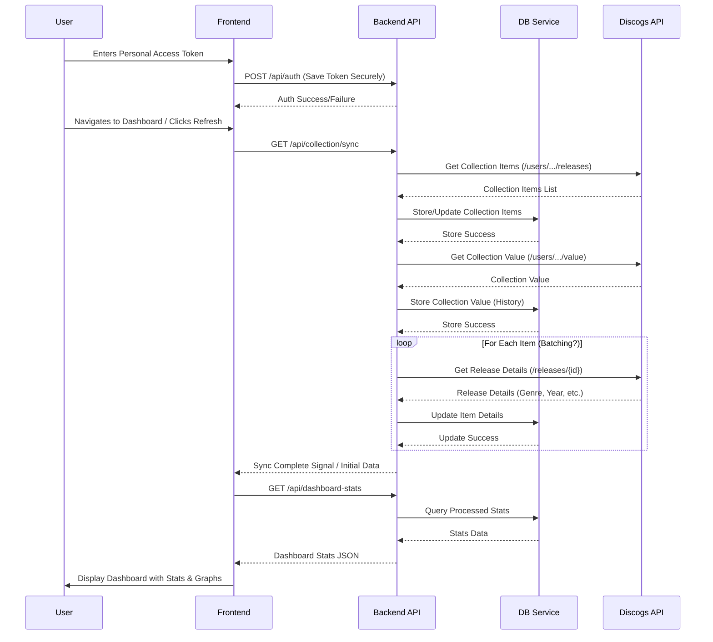

# Discogs Collection Dashboard - Project Plan

## 1. Overview

Build a web application using Next.js, TypeScript, and Tailwind CSS to serve as a dashboard for a user's Discogs vinyl collection. The app will authenticate with the Discogs API, fetch collection data, store relevant information, calculate statistics, and display them in a modern, dark-themed interface with graphs.

## 2. Technology Stack

*   **Framework:** Next.js (React framework with backend capabilities)
*   **Language:** TypeScript
*   **Styling:** Tailwind CSS
*   **Charting:** Chart.js or Recharts (TBD during implementation)
*   **Database:** SQLite (Simple, file-based, good for single-user or development)
*   **Discogs API Client:** Potentially `disconnect` Node.js library, or direct `fetch` calls.
*   **State Management:** React Context API or Zustand (TBD, if needed beyond Next.js capabilities)

## 3. Core Features

*   **Discogs API Authentication:** Allow users to input their Discogs Personal Access Token. Securely store the token (e.g., in environment variables or a secure local store, *not* in the database directly if possible, or encrypted if necessary).
*   **Collection Data Retrieval:** Fetch all items from the user's collection (`/users/{username}/collection/folders/0/releases`).
*   **Detailed Item Data:** Fetch details for individual releases as needed (potentially `/releases/{release_id}`) to get genre, year, etc. (Consider API rate limits).
*   **Collection Value:** Fetch current collection value (`/users/{username}/collection/value`).
*   **Data Storage:** Store relevant collection item details and historical statistics in an SQLite database.
*   **Statistics Calculation:**
    *   Total Items in Collection
    *   Total Collection Value (Min, Mean, Max)
    *   Top 5 Most Valuable Items
    *   Top 5 Least Valuable Items
    *   Average Price Per Item
    *   Genre Distribution
    *   Release Year Distribution
    *   Top Artists/Labels
    *   Format Breakdown (Vinyl, CD, Cassette etc.)
*   **Dashboard Display:** Present statistics clearly using text, tables, and graphs on a dark-themed UI.
*   **Data Synchronization:** Provide a mechanism to refresh data from the Discogs API.

## 4. Architecture

```mermaid
graph TD
    A[User Browser (Next.js Frontend)] --> B{Next.js API Routes};
    B --> C[Discogs API Client];
    C --> D[Discogs API];
    B --> E[Database Service (SQLite)];
    E --> F[(SQLite DB)];

    subgraph "Frontend (React Components)"
        A
    end

    subgraph "Backend (Next.js)"
        B
        C
        E
    end

    subgraph "External"
        D
    end

    subgraph "Persistence"
        F
    end
```

## 5. Data Flow (Initial Fetch & Display)



## 6. Database Schema (Initial Draft)

*   **`settings`**
    *   `key` (TEXT, PRIMARY KEY) - e.g., 'discogs_username', 'last_sync_time'
    *   `value` (TEXT)
*   **`collection_items`**
    *   `id` (INTEGER, PRIMARY KEY) - Discogs Instance ID
    *   `release_id` (INTEGER) - Discogs Release ID
    *   `artist` (TEXT)
    *   `title` (TEXT)
    *   `year` (INTEGER)
    *   `format` (TEXT)
    *   `genres` (TEXT) - Comma-separated or JSON
    *   `styles` (TEXT) - Comma-separated or JSON
    *   `cover_image_url` (TEXT)
    *   `added_date` (TEXT) - ISO 8601 Format
    *   `folder_id` (INTEGER)
    *   `rating` (INTEGER)
    *   `notes` (TEXT) - Potentially, if needed
    *   `estimated_value` (REAL) - Store latest known value per item if available/desired
*   **`collection_stats_history`**
    *   `timestamp` (TEXT, PRIMARY KEY) - ISO 8601 Format
    *   `total_items` (INTEGER)
    *   `value_min` (REAL)
    *   `value_mean` (REAL)
    *   `value_max` (REAL)

## 7. Implementation Steps

1.  **Project Setup:** Initialize Next.js project with TypeScript and Tailwind CSS. **(DONE)**
2.  **Authentication UI:** Create a simple settings page/component to input and save the Discogs username and Personal Access Token.
3.  **Backend Auth Endpoint:** Create a Next.js API route (`/api/auth`) to securely handle token storage (details TBD - environment variables, secure config).
4.  **Discogs Client:** Set up the Discogs API client (either `disconnect` or basic `fetch` wrappers). Implement basic calls for username validation and fetching folders.
5.  **Database Setup:** Integrate SQLite (e.g., using `better-sqlite3` or Prisma). Define the initial schema and create migration/setup scripts.
6.  **Data Fetching Service:** Create backend logic (likely triggered by an API route like `/api/collection/sync`) to:
    *   Fetch all collection items.
    *   Fetch collection value.
    *   Fetch details for items (consider rate limiting and batching).
    *   Store/update data in the SQLite database.
    *   Record historical stats in `collection_stats_history`.
7.  **Statistics Service:** Create backend logic/API route (`/api/dashboard-stats`) to query the database and calculate all required statistics.
8.  **Frontend Dashboard UI:** Build the main dashboard page.
    *   Layout using Tailwind CSS (dark theme).
    *   Components for displaying individual stats (KPI cards).
    *   Components for tables (Top/Least Valuable Items).
    *   Integrate charting library to display graphs (Value history, Item count history, Genre/Year distribution).
9.  **Data Display:** Connect frontend components to fetch data from the backend API routes and display it.
10. **Refinement & Styling:** Polish the UI/UX, ensure responsiveness, and handle loading/error states.
11. **Error Handling & Rate Limiting:** Implement robust error handling and respect Discogs API rate limits.
12. **Testing:** Add basic tests (unit/integration) where appropriate.

## 8. Potential Challenges & Considerations

*   **Discogs API Rate Limits:** The API has rate limits (check documentation). Fetching details for every item in a large collection might require careful planning (batching, delays, fetching only on demand?).
*   **Data Consistency:** How often should the data be synced? Manual trigger? Scheduled background task (more complex)?
*   **Token Security:** Storing the Personal Access Token securely is crucial. Avoid committing it to Git. Environment variables are a common approach for Next.js.
*   **Scalability:** SQLite is simple but might become a bottleneck for *very* large collections or concurrent users (though likely fine for a personal dashboard). Could migrate to PostgreSQL later if needed.
*   **`disconnect` Library Status:** Verify if it's maintained and works with current API/OAuth practices.